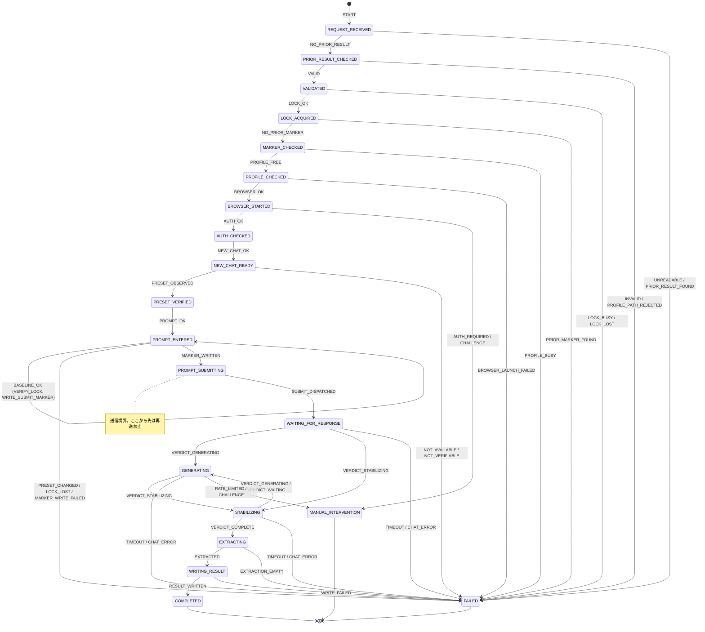

# 11 — State Machine

| 項目 | 値 |
|---|---|
| 文書版 | 1.3 (Phase 3、Codex レビュー反映。FROZEN FOR MVP v1.0、2026-09-15) |
| 作成日 | 2026-09-14 |
| 上位文書 | `10-ARCHITECTURE.md` §4, §6、`02-REQUIREMENTS.md` FR-014, FR-016, FR-025〜029, FR-035〜038, FR-042 |

## 1. 原則

- 状態機械は **純関数** `transition(state, event) → { next, effects[] }` として実装し、Playwright に依存しない（NFR-007）。
- 状態型は `{ name: StateName; attempts: Record<StateName, number>; submitted: 'no' | 'unknown' | 'yes' }`。`attempts[s]` は状態 `s` で受け取った `RETRYABLE_STEP_FAILED` の回数。`transition` は受領時に +1 してから `< max` を判定する（max=3 なら初回 + 再試行 2 回 = 計 3 試行）。
- **controller の規約**: effects は列挙順に逐次実行し、ある effect がイベントを生じた時点で残りの effects は実行しない。各 effect の結果は最大 1 つのイベントとして状態機械へ戻す。ただし **best-effort effect**（`CAPTURE`, `STOP_TRACE`, `INSPECT_UI_REPORT`, `UPDATE_MARKER`, `DELETE_MARKER`, `CLOSE_BROWSER`）は失敗してもイベントを生じず、`result.json.warnings[]` に記録して次の effect へ進む。したがって `WRITE_RESULT` は診断成果物の失敗で省略されない。
- **状態**と**エラーコード**は別物。終端状態は `COMPLETED` / `FAILED` / `MANUAL_INTERVENTION` の 3 つのみで、原因は `error.code`（`13-ERROR-MODEL.md`）で表す（FR-040）。
- **送信境界**: `PROMPT_ENTERED → PROMPT_SUBMITTING` の遷移（`MARKER_WRITTEN` 受領時）でのみ `DISPATCH_SUBMIT` effect が発火する。以降、`PROMPT_ENTERED` 以前の状態へ戻る遷移は存在しない（FR-038, AC-018）。
- **`DOM_UNEXPECTED` の範囲**: `BROWSER_STARTED` 〜 `PROMPT_ENTERED` でのみ発生し得る。`PROMPT_SUBMITTING` 以降のいかなる状態でも発生させない（`observe()` / `dispatchSubmit()` / 抽出は例外を投げない読み取り API を使う。`14-SELECTOR-STRATEGY.md` §1, §5）。
- **再試行**は `RETRYABLE_STEP_FAILED` を受けた場合に限り、送信境界より前の 4 状態で、上限内なら同じ状態に留まる（FR-042）。上限超過時のコードは §5 の表で一意に決まる。
- `OBSERVATION`（250 ms 周期の観測スナップショット）は状態機械のイベントではない。controller が `completion.judge()` に渡し、その戻り値 `VERDICT_*` を状態機械のイベントにする。`VERDICT_*` は `WAITING_FOR_RESPONSE` / `GENERATING` / `STABILIZING` の 3 状態でのみ配送され、`STOP_OBSERVATION_LOOP` 以降は配送しない（controller の責務）。

## 2. 状態一覧

| 状態 | 意味 | 送信境界 | `submitted` |
|---|---|---|---|
| `IDLE` | 開始前 | 前 | no |
| `REQUEST_RECEIVED` | `request.json` を読み（BOM 除去後 parse）、`requestId`（無効なら null）を取り出した | 前 | no |
| `PRIOR_RESULT_CHECKED` | `requestDir/result.json` が無いことを確認した | 前 | no |
| `VALIDATED` | Ajv 検証・prompt 読取・非空確認・プロファイルパス検証を通過した | 前 | no |
| `LOCK_ACQUIRED` | `bridge.lock` を取得し、所有トークンを再読取で確認した | 前 | no |
| `MARKER_CHECKED` | ロック保持下で `runtime/state/<requestId>/submit.marker` が無いことを確認した | 前 | no |
| `PROFILE_CHECKED` | 専用プロファイルが他プロセスに占有されていないことを確認した | 前 | no |
| `BROWSER_STARTED` | 永続コンテキスト起動、trace 開始、クラッシュ購読済み | 前 | no |
| `AUTH_CHECKED` | chatgpt.com 上でログイン済み、チャレンジ・上限表示無しを確認した | 前 | no |
| `NEW_CHAT_READY` | 新規チャット画面で入力欄が一意・空、`stopButton` 不在（生成中でない）を確認した | 前 | no |
| `PRESET_VERIFIED` | `observedPreset` を確定した（`current` は観測のみ、それ以外は選択＋一致確認。逆引きは一意） | 前 | no |
| `PROMPT_ENTERED` | 入力欄の内容が prompt と一致。続いて送信前スナップショット（preset 再観測、`sendButton` の解決、assistant 数、URL）とロック再検証を行い、marker を書く | 前 | no |
| `PROMPT_SUBMITTING` | マーカー書込済み。解決済みの `sendButton` を 1 回だけクリックする | **境界** | **unknown** |
| `WAITING_FOR_RESPONSE` | 送信後、新しい assistant ターンの出現を待つ | 後 | yes |
| `GENERATING` | 新 assistant が出現し、生成中 UI を観測している | 後 | yes |
| `STABILIZING` | 生成中 UI が消え、本文の不変と入力欄の復帰を確認中 | 後 | yes |
| `EXTRACTING` | 抽出（copy → dom → innerText）中 | 後 | yes |
| `WRITING_RESULT` | `response.md` → [trace] → `result.json` を書いている | 後 | yes |
| `COMPLETED` | 終端（成功） | — | yes |
| `FAILED` | 終端（`status: failed`） | — | 状態による |
| `MANUAL_INTERVENTION` | 終端（`status: manual_intervention_required`） | — | 状態による |

`submitted` は終端時の直前状態から決まる: `PROMPT_SUBMITTING` で終端 → `unknown`、`WAITING_FOR_RESPONSE` 以降 → `yes`、それ以前 → `no`。例外は `SUBMIT_STATE_UNKNOWN`（前回の marker 残存）で `unknown`。

## 3. イベント一覧

| イベント | 発生元 | ペイロード / 条件 |
|---|---|---|
| `START` | CLI | requestPath |
| `REQUEST_READ` | contracts | `{ requestId: string \| null, raw }`（欠落・パターン不一致・Windows 予約名は null） |
| `REQUEST_UNREADABLE` | contracts | cause（ファイル不在・JSON 構文エラー・UTF-8 でない） |
| `PRIOR_RESULT_FOUND` / `STALE_RESPONSE_FOUND` / `NO_PRIOR_RESULT` | contracts | path / path（`result.json` 無しで `response.md` あり） / —（requestId null なら常に `NO_PRIOR_RESULT`） |
| `VALID` / `INVALID` | contracts | request / errors[] |
| `PROFILE_PATH_REJECTED` | browser | path |
| `LOCK_OK` / `LOCK_BUSY` / `LOCK_LOST` | lock | — / holder / —（取得直後・marker 書込直前の再検証で自トークンが無い） |
| `PRIOR_MARKER_FOUND` / `NO_PRIOR_MARKER` | lock | marker / — |
| `PROFILE_FREE` / `PROFILE_BUSY` | browser | — / cause |
| `BROWSER_OK` / `BROWSER_LAUNCH_FAILED` | browser | — / cause |
| `BROWSER_CRASHED` | browser（`BROWSER_STARTED` 以降の任意の状態） | cause |
| `AUTH_OK` / `AUTH_REQUIRED` / `CHALLENGE(kind)` / `WRONG_PAGE` | chatgpt | — / — / `kind ∈ { captcha, consent, rate_limited }` / url。判定できない（`composer` も `loginCta` も無い）場合は `RETRYABLE_STEP_FAILED(step: auth)` |
| `NEW_CHAT_OK` / `NEW_CHAT_FAILED(cause)` | chatgpt | — / `cause ∈ { existing_conversation, generating, composer_not_empty }`（`composer` 出現後に最終判定。`composer` 未出現は `RETRYABLE_STEP_FAILED`） |
| `PRESET_OBSERVED(p)` / `PRESET_NOT_AVAILABLE` / `PRESET_NOT_VERIFIABLE` | chatgpt | preset / 選択肢 0 件 / 逆引き不能・非一意・選択後不一致・選択肢 2 件以上 |
| `PROMPT_OK` / `PROMPT_MISMATCH` | chatgpt | `enterPrompt` は内部で最大 2 回の全消去・再入力を行い、それでも不一致なら `PROMPT_MISMATCH` を 1 回だけ発火。`RETRYABLE_STEP_FAILED` は `composer` の一時的な未解決のみ |
| `BASELINE_OK` / `PRESET_CHANGED` | chatgpt | スナップショット { assistantCount, url, presetLabel, sendButton 解決済み } / preset 表示が `PRESET_VERIFIED` 時と異なる |
| `MARKER_WRITTEN` / `MARKER_WRITE_FAILED` | lock | — / cause（rename 完了後にのみ `MARKER_WRITTEN`） |
| `SUBMIT_DISPATCHED` / `SUBMIT_FAILED(cause)` / `SUBMIT_ABORTED(preset_changed)` | chatgpt | — / `cause ∈ { click_failed, send_button_missing, send_button_disabled }` / click 直前の preset 再観測が baseline と不一致（click していない） |
| `VERDICT_WAITING` | completion | 新 assistant 未出現（一過性の 0 件を含む） |
| `VERDICT_GENERATING` | completion | — |
| `VERDICT_STABILIZING` | completion | — |
| `VERDICT_COMPLETE` | completion | — |
| `VERDICT_TIMEOUT` | completion | 真にスタール（`streaming === false`） |
| `VERDICT_TIMEOUT_ACTIVE` | completion | タイムアウト到達時点で `streaming === true`（生成継続中の可能性、2026-09-17 #124） |
| `VERDICT_CHAT_ERROR(cause)` | completion | `cause ∈ { banner, network, output_truncated, multiple_responses }` |
| `VERDICT_RATE_LIMITED` | completion | — |
| `VERDICT_CHALLENGE(kind)` | completion | `kind ∈ { login, captcha, consent }` |
| `EXTRACTED` / `EXTRACTION_EMPTY(cause)` | extraction | `{ method, quality, markdown }` / `cause ∈ { empty, canvas }` |
| `RESULT_WRITTEN` / `WRITE_FAILED(file)` | contracts | — / `file ∈ { response, result }` |
| `DOM_UNEXPECTED` | chatgpt（`BROWSER_STARTED` 〜 `PROMPT_ENTERED` のみ） | element, candidatesTried[] |
| `RETRYABLE_STEP_FAILED(step)` | chatgpt/browser | step, cause |
| `TIMEOUT(phase)` | controller | 送信前フェーズの上限超過（§5） |

## 4. 遷移表

凡例: `→ FAILED(CODE)` は終端 `FAILED` へ遷移し `error.code = CODE`。`→ MI(CODE)` は `MANUAL_INTERVENTION`。`⟲` は同状態に留まる。

effects の定義:
- `CAPTURE` = viewport スクリーンショット → `artifacts[]`
- `STOP_TRACE` = `tracing.stop` → サニタイズ → `artifacts/<id>/trace.zip` → `artifacts[]`。`(if enabled)` は `CHATGPT_BRIDGE_TRACE_ON_SUCCESS=1` のときのみ。`(best-effort)` はブラウザ切断後で失敗を許容
- `INSPECT_UI_REPORT` = 全 `ElementKey` の候補ごとの一致数・可視性を `artifacts/<id>/inspect-ui.json` に書く → `artifacts[]`
- `WRITE_RESULT` = `result.json` をアトミック書き出し（`artifacts` は既に確定済み）。結果は `RESULT_WRITTEN` / `WRITE_FAILED(result)`
- `WRITE_RESULT` の直前（同じ effect 内、A-073 / A-099）: ブラウザが生きていてクラッシュ検出が無ければ `restoreEffort()`（思考量スライダーを実行前の段階へ戻す。上限 15 s、失敗は `warnings[].restore_effort_failed` に載ってから result が書かれる）
- `CLOSE_BROWSER` = `context.close()`（上限 15 s、超過時は子プロセス kill）。復元が未実施なら先に行う（通常は `WRITE_RESULT` で済んでいる）
- `EXTRACT_LATEST` = 最新 assistant ターンの抽出（copy → dom → innerText）。（Phase 6 追加、A-091）抽出成功後に同じ effect 内で `captureImages(dir, signal)`（best-effort、120 s で abort し完了を待つ（A-100）、失敗は `warnings[].image_capture_failed`）を行い、`images[]` と `response.md` 末尾のリンクを確定する。本文が空で画像も保存できなければ `EXTRACTION_EMPTY`（成功にしない）
- `ENTER_PROMPT` = 本文の入力と照合。（Phase 5 追加、A-081 / A-084）添付があれば続けて `setInputFiles` → チップ数一致 → 送信ボタンの `aria-disabled` 解除まで待つ。フェーズ上限 60 s は `uploadBudgetMs` だけ延長
- `OPEN_NEW_CHAT` = `newChat: true` なら `https://chatgpt.com/` へ遷移、`false` なら `conversationUrl` を開いて origin / パス / 既存ターン / 非生成中 / 空入力欄を確認（A-096 / A-098）。失敗の cause に `conversation_not_found` を追加
- `RELEASE_LOCK` = `bridge.lock` を読み、自トークンのときのみ削除
- `STOP_OBSERVATION_LOOP` = 以後 `VERDICT_*` を配送しない
- `UPDATE_MARKER` = marker に `dispatchedAt` / `urlAfter` を追記（best-effort）
- `DELETE_MARKER` = click しなかったことが確定した場合に marker を削除（best-effort。残っても次回は `SUBMIT_STATE_UNKNOWN` で安全側）
- best-effort effect の失敗は `result.json.warnings[]`（例 `"screenshot_failed: <cause>"`）に記録し、イベントを生じない
- `FAIL_AFTER_BROWSER` = `CAPTURE, STOP_TRACE, WRITE_RESULT, CLOSE_BROWSER, RELEASE_LOCK`（この順）
- `FAIL_BEFORE_BROWSER` = `WRITE_RESULT, RELEASE_LOCK(if held)`

| 現在状態 | イベント | 次状態 | effects / 終了コード |
|---|---|---|---|
| `IDLE` | `START` | `REQUEST_RECEIVED` | `READ_REQUEST` |
| `REQUEST_RECEIVED` | `REQUEST_READ` | `REQUEST_RECEIVED` ⟲ | `CHECK_PRIOR_RESULT(requestId)` |
| `REQUEST_RECEIVED` | `REQUEST_UNREADABLE` | `FAILED(INVALID_REQUEST)` | `STDERR`, `EXIT(2)`（result.json 無し） |
| `REQUEST_RECEIVED` | `PRIOR_RESULT_FOUND` | `FAILED(ALREADY_PROCESSED)` | `STDERR`, `EXIT(4)`（result.json 無し） |
| `REQUEST_RECEIVED` | `STALE_RESPONSE_FOUND` | `FAILED(INVALID_REQUEST)` | `WRITE_RESULT(cause: stale_response)`, `EXIT(2)`（`response.md` は削除しない） |
| `REQUEST_RECEIVED` | `NO_PRIOR_RESULT` | `PRIOR_RESULT_CHECKED` | `VALIDATE` |
| `PRIOR_RESULT_CHECKED` | `VALID` | `VALIDATED` | `ACQUIRE_LOCK` |
| `PRIOR_RESULT_CHECKED` | `INVALID` | `FAILED(INVALID_REQUEST)` | `WRITE_RESULT(requestId or null)`, `EXIT(2)` |
| `PRIOR_RESULT_CHECKED` | `PROFILE_PATH_REJECTED` | `FAILED(INVALID_CONFIG)` | `WRITE_RESULT`, `EXIT(2)` |
| `VALIDATED` | `LOCK_OK` | `LOCK_ACQUIRED` | `CHECK_MARKER(requestId)` |
| `VALIDATED` | `LOCK_BUSY` / `LOCK_LOST` | `FAILED(ALREADY_RUNNING)` | `STDERR`, `EXIT(4)`（result.json 無し） |
| `LOCK_ACQUIRED` | `NO_PRIOR_MARKER` | `MARKER_CHECKED` | `CHECK_PROFILE_FREE` |
| `LOCK_ACQUIRED` | `PRIOR_MARKER_FOUND` | `FAILED(SUBMIT_STATE_UNKNOWN)` | `FAIL_BEFORE_BROWSER`, `EXIT(1)`（`submitted: unknown`） |
| `MARKER_CHECKED` | `PROFILE_FREE` | `PROFILE_CHECKED` | `LAUNCH_BROWSER` |
| `MARKER_CHECKED` | `PROFILE_BUSY` | `FAILED(PROFILE_IN_USE)` | `FAIL_BEFORE_BROWSER`, `EXIT(4)` |
| `PROFILE_CHECKED` | `BROWSER_OK` | `BROWSER_STARTED` | `NAVIGATE_AND_CHECK_AUTH` |
| `PROFILE_CHECKED` | `BROWSER_LAUNCH_FAILED` | `FAILED(BROWSER_LAUNCH_FAILED)` | `FAIL_BEFORE_BROWSER`, `EXIT(4)`（trace 無し） |
| `BROWSER_STARTED` | `AUTH_OK` | `AUTH_CHECKED` | `OPEN_NEW_CHAT` |
| `BROWSER_STARTED` | `AUTH_REQUIRED` | `MI(AUTH_REQUIRED)` | `FAIL_AFTER_BROWSER`, `EXIT(3)` |
| `BROWSER_STARTED` | `CHALLENGE(captcha)` | `MI(CAPTCHA_OR_CHALLENGE)` | 同上 |
| `BROWSER_STARTED` | `CHALLENGE(consent)` | `MI(MANUAL_INTERVENTION_REQUIRED)` | 同上 |
| `BROWSER_STARTED` | `CHALLENGE(rate_limited)` | `MI(RATE_LIMITED)` | 同上 |
| `BROWSER_STARTED` | `WRONG_PAGE` | `FAILED(INVALID_STATE)` | `FAIL_AFTER_BROWSER`, `EXIT(1)` |
| `BROWSER_STARTED` | `RETRYABLE_STEP_FAILED`（attempts < 3） | ⟲ | `NAVIGATE_AND_CHECK_AUTH` |
| `BROWSER_STARTED` | `RETRYABLE_STEP_FAILED`（attempts ≥ 3）/ `TIMEOUT` | `FAILED(INVALID_STATE)` | `FAIL_AFTER_BROWSER`, `EXIT(1)` |
| `AUTH_CHECKED` | `NEW_CHAT_OK` | `NEW_CHAT_READY` | `RESOLVE_PRESET(requested)` |
| `AUTH_CHECKED` | `NEW_CHAT_FAILED(cause)` | `FAILED(PROMPT_SUBMIT_FAILED)` | `FAIL_AFTER_BROWSER`, `EXIT(1)` |
| `AUTH_CHECKED` | `RETRYABLE_STEP_FAILED`（attempts < 3） | ⟲ | `OPEN_NEW_CHAT` |
| `AUTH_CHECKED` | `RETRYABLE_STEP_FAILED`（attempts ≥ 3）/ `TIMEOUT` | `FAILED(DOM_CHANGED)` | `INSPECT_UI_REPORT`, `FAIL_AFTER_BROWSER`, `EXIT(1)` |
| `NEW_CHAT_READY` | `PRESET_OBSERVED(p)` | `PRESET_VERIFIED` | `ENTER_PROMPT` |
| `NEW_CHAT_READY` | `PRESET_NOT_AVAILABLE` | `FAILED(MODEL_NOT_AVAILABLE)` | `FAIL_AFTER_BROWSER`, `EXIT(1)` |
| `NEW_CHAT_READY` | `PRESET_NOT_VERIFIABLE` | `FAILED(MODEL_NOT_VERIFIABLE)` | 同上 |
| `NEW_CHAT_READY` | `RETRYABLE_STEP_FAILED`（attempts < 2） | ⟲ | `RESOLVE_PRESET` |
| `NEW_CHAT_READY` | `RETRYABLE_STEP_FAILED`（attempts ≥ 2）/ `TIMEOUT` | `FAILED(MODEL_NOT_VERIFIABLE)` | 同上 |
| `PRESET_VERIFIED` | `PROMPT_OK` | `PROMPT_ENTERED` | `SNAPSHOT_BASELINE`（preset 再観測、`sendButton` 解決、assistant 数、URL） |
| `PRESET_VERIFIED` | `PROMPT_MISMATCH` | `FAILED(PROMPT_INPUT_FAILED)` | `FAIL_AFTER_BROWSER`, `EXIT(1)` |
| `PRESET_VERIFIED` | `RETRYABLE_STEP_FAILED`（attempts < 2） | ⟲ | `ENTER_PROMPT` |
| `PRESET_VERIFIED` | `RETRYABLE_STEP_FAILED`（attempts ≥ 2）/ `TIMEOUT` | `FAILED(PROMPT_INPUT_FAILED)` | 同上 |
| `PROMPT_ENTERED` | `BASELINE_OK` | `PROMPT_ENTERED` ⟲ | `VERIFY_LOCK`, `WRITE_SUBMIT_MARKER` |
| `PROMPT_ENTERED` | `PRESET_CHANGED` | `FAILED(MODEL_NOT_VERIFIABLE)` | `FAIL_AFTER_BROWSER`, `EXIT(1)`（marker 未書込、`submitted: no`） |
| `PROMPT_ENTERED` | `LOCK_LOST` | `FAILED(ALREADY_RUNNING)` | `CAPTURE`, `STOP_TRACE`, `CLOSE_BROWSER`, `STDERR`, `EXIT(4)`（result.json 無し、marker 未書込。`cause: lock_lost`） |
| `PROMPT_ENTERED` | `MARKER_WRITTEN` | `PROMPT_SUBMITTING` | `DISPATCH_SUBMIT` |
| `PROMPT_ENTERED` | `MARKER_WRITE_FAILED` | `FAILED(WRITE_FAILED)` | `FAIL_AFTER_BROWSER`, `EXIT(1)`（送信していない） |
| `PROMPT_SUBMITTING` | `SUBMIT_DISPATCHED` | `WAITING_FOR_RESPONSE` | `UPDATE_MARKER`, `START_OBSERVATION_LOOP` |
| `PROMPT_SUBMITTING` | `SUBMIT_FAILED(cause)` | `FAILED(PROMPT_SUBMIT_FAILED)` | `FAIL_AFTER_BROWSER`, `EXIT(1)`（`submitted: unknown`、**再送しない**） |
| `PROMPT_SUBMITTING` | `SUBMIT_ABORTED(preset_changed)` | `FAILED(MODEL_NOT_VERIFIABLE)` | `DELETE_MARKER(best-effort)`, `FAIL_AFTER_BROWSER`, `EXIT(1)`（click していないため `submitted: no`） |
| `WAITING_FOR_RESPONSE` | `VERDICT_WAITING` / `VERDICT_STABILIZING`※ | ⟲ | — |
| `WAITING_FOR_RESPONSE` | `VERDICT_GENERATING` | `GENERATING` | — |
| `WAITING_FOR_RESPONSE` | `VERDICT_COMPLETE` | `EXTRACTING` | `STOP_OBSERVATION_LOOP`, `EXTRACT_LATEST` |
| `GENERATING` | `VERDICT_GENERATING` / `VERDICT_WAITING`（一過性の 0 件） | ⟲ | — |
| `GENERATING` | `VERDICT_STABILIZING` | `STABILIZING` | — |
| `GENERATING` | `VERDICT_COMPLETE` | `EXTRACTING` | `STOP_OBSERVATION_LOOP`, `EXTRACT_LATEST` |
| `STABILIZING` | `VERDICT_STABILIZING` | ⟲ | — |
| `STABILIZING` | `VERDICT_GENERATING` / `VERDICT_WAITING` | `GENERATING` | —（再開・一過性の揺れ。安定化の起点はリセット） |
| `STABILIZING` | `VERDICT_COMPLETE` | `EXTRACTING` | `STOP_OBSERVATION_LOOP`, `EXTRACT_LATEST` |
| `WAITING_FOR_RESPONSE` / `GENERATING` / `STABILIZING` | `VERDICT_TIMEOUT` | `FAILED(GENERATION_TIMEOUT)` | `STOP_OBSERVATION_LOOP`, `FAIL_AFTER_BROWSER`, `EXIT(1)` |
| 同上 | `VERDICT_TIMEOUT_ACTIVE` | `FAILED(GENERATION_TIMEOUT_ACTIVE)` | 同上 |
| 同上 | `VERDICT_CHAT_ERROR(cause)` | `FAILED(CHAT_ERROR)` | 同上（`error.cause` に理由） |
| 同上 | `VERDICT_RATE_LIMITED` | `MI(RATE_LIMITED)` | `STOP_OBSERVATION_LOOP`, `FAIL_AFTER_BROWSER`, `EXIT(3)` |
| 同上 | `VERDICT_CHALLENGE(login)` | `MI(AUTH_REQUIRED)` | 同上 |
| 同上 | `VERDICT_CHALLENGE(captcha)` | `MI(CAPTCHA_OR_CHALLENGE)` | 同上 |
| 同上 | `VERDICT_CHALLENGE(consent)` | `MI(MANUAL_INTERVENTION_REQUIRED)` | 同上 |
| `EXTRACTING` | `EXTRACTED` | `WRITING_RESULT` | `WRITE_RESPONSE_MD`, `STOP_TRACE(if enabled)`, `WRITE_RESULT(completed)` |
| `EXTRACTING` | `EXTRACTION_EMPTY(cause)` | `FAILED(EXTRACTION_FAILED)` | `FAIL_AFTER_BROWSER`, `EXIT(1)` |
| `WRITING_RESULT` | `RESULT_WRITTEN` | `COMPLETED` | `CLOSE_BROWSER`, `RELEASE_LOCK`, `EXIT(0)` |
| `WRITING_RESULT` | `WRITE_FAILED(response)` | `FAILED(WRITE_FAILED)` | `FAIL_AFTER_BROWSER`, `EXIT(1)` |
| `WRITING_RESULT` | `WRITE_FAILED(result)` | `FAILED(WRITE_FAILED)` | `STDERR`, `CLOSE_BROWSER`, `RELEASE_LOCK`, `EXIT(1)`（result.json 無し） |
| `BROWSER_STARTED` 〜 `WRITING_RESULT` | `BROWSER_CRASHED` | `FAILED(BROWSER_CRASHED)` | `STOP_OBSERVATION_LOOP`, `CAPTURE(best-effort)`, `STOP_TRACE(best-effort)`, `WRITE_RESULT`, `CLOSE_BROWSER(best-effort)`, `RELEASE_LOCK`, `EXIT(1)` |
| `BROWSER_STARTED` 〜 `PROMPT_ENTERED` | `DOM_UNEXPECTED` | `FAILED(DOM_CHANGED)` | `INSPECT_UI_REPORT`, `FAIL_AFTER_BROWSER`, `EXIT(1)` |
| 任意の非終端状態 | 未定義イベント | `FAILED(INTERNAL_ERROR)` | ブラウザ起動後なら `STOP_OBSERVATION_LOOP`, `FAIL_AFTER_BROWSER`、前なら `FAIL_BEFORE_BROWSER`。`EXIT(1)` |

※ `WAITING_FOR_RESPONSE` で `VERDICT_STABILIZING` が届くのは代替経路（生成中 UI 未観測）で、状態はそのまま `STABILIZING` へ遷移してよい。表では `WAITING_FOR_RESPONSE | VERDICT_STABILIZING → STABILIZING` とする（上の ⟲ は `VERDICT_WAITING` のみに適用）。

送信後 3 状態 × `VERDICT_*` 9 種はすべて上の表で定義されている（表駆動テストで総当たり検証、16 §2）。

## 5. 再試行と送信前タイムアウト（FR-042）

| 状態 | 対象の一時失敗（`RETRYABLE_STEP_FAILED` を発火するもの） | 試行上限 | 上限超過 / `TIMEOUT` 時のコード | フェーズ上限（`TIMEOUT` 発火） |
|---|---|---|---|---|
| `BROWSER_STARTED` | ページロード失敗、`observeAuth` が判定不能（`composer` も `loginCta` も無い） | 3（各試行前に 1 s 待機。唯一の固定待機） | `INVALID_STATE` | 60 s |
| `AUTH_CHECKED` | 新規チャット遷移後に `composer` が出現しない | 3 | `DOM_CHANGED` | 30 s |
| `NEW_CHAT_READY` | preset メニューの一時的な未出現 | 2 | `MODEL_NOT_VERIFIABLE` | 30 s |
| `PRESET_VERIFIED` | `composer` の一時的な未解決（内容不一致は `enterPrompt` 内部で最大 2 回再入力し、超えれば `PROMPT_MISMATCH`） | 2 | `PROMPT_INPUT_FAILED` | 60 s |
| `PROMPT_SUBMITTING` 以降 | **なし** | 0 | — | `timeoutMs`（送信後は `completion.judge` が `VERDICT_TIMEOUT` を返す） |

フェーズ上限は `10-ARCHITECTURE.md` §9 の定数（A-029）。

## 6. 送信境界の不変条件（AC-018 でテスト）

1. `DISPATCH_SUBMIT` effect は `transition(PROMPT_ENTERED, MARKER_WRITTEN)` の戻り値にのみ現れ、その `next` は `PROMPT_SUBMITTING` である。
2. 状態機械のいかなる遷移も `PROMPT_SUBMITTING` 以降の状態から `PROMPT_ENTERED` 以前の状態へ戻らない。
3. 終端時の `result.json.submitted`: 直前状態が `PROMPT_SUBMITTING` → `"unknown"`、`WAITING_FOR_RESPONSE` 以降 → `"yes"`、それ以前 → `"no"`。例外は `SUBMIT_STATE_UNKNOWN` → `"unknown"`、および `SUBMIT_ABORTED`（click 前に中止）→ `"no"`。
4. 次回起動時に `runtime/state/<requestId>/submit.marker` が存在し `requestDir/result.json` が無ければ、ロック取得後に `SUBMIT_STATE_UNKNOWN` で終了し、ブラウザを起動しない。marker が 0 バイト・JSON 不正でも「存在」として扱う。
5. `PRIOR_MARKER_FOUND` の判定は **ロック保持下でのみ**行う。同一 requestId の進行中プロセスがある間は必ず `LOCK_BUSY → ALREADY_RUNNING` になり、進行中の結果を壊す `result.json` は書かれない（FR-036）。
6. `WRITE_SUBMIT_MARKER` の直前に `VERIFY_LOCK`（`bridge.lock` の所有トークンが自分か）を行い、失敗なら marker を書かずに `LOCK_LOST → ALREADY_RUNNING` で終了する。したがってロックを奪われたプロセスは送信しない。
7. `SNAPSHOT_BASELINE` で `sendButton` を解決済みにするため、`PROMPT_SUBMITTING` では `DOM_UNEXPECTED` が発生しない。クリック時に要素が消えていれば `SUBMIT_FAILED(send_button_missing)` → `PROMPT_SUBMIT_FAILED`（`submitted: unknown`）。
8. `DISPATCH_SUBMIT` は click の直前に preset 表示を再観測（`probe`）し、baseline と不一致なら click せず `SUBMIT_ABORTED(preset_changed)` を返す。これにより marker 書込から click までの間の preset 変化でも異なる preset で送信されない。
9. 診断成果物（screenshot / trace / inspect-ui）の失敗は `WRITE_RESULT` を妨げない（best-effort effect）。

## 7. 図

